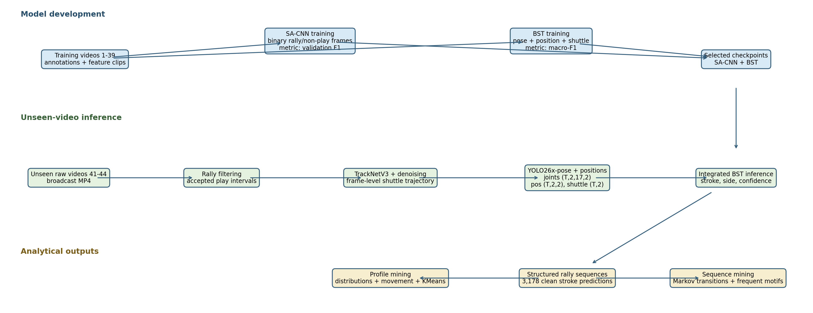
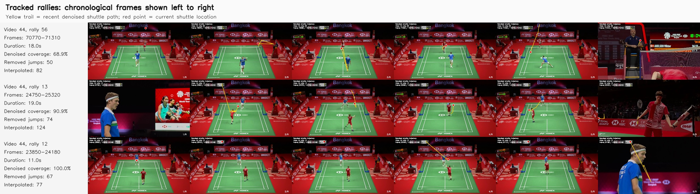
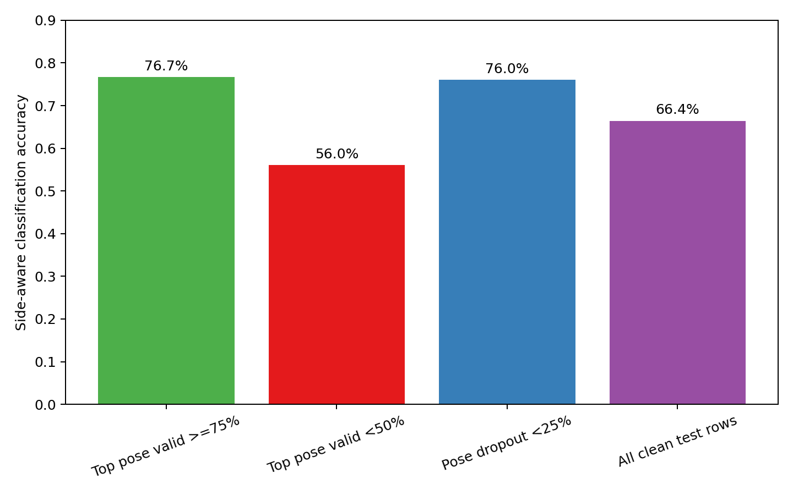
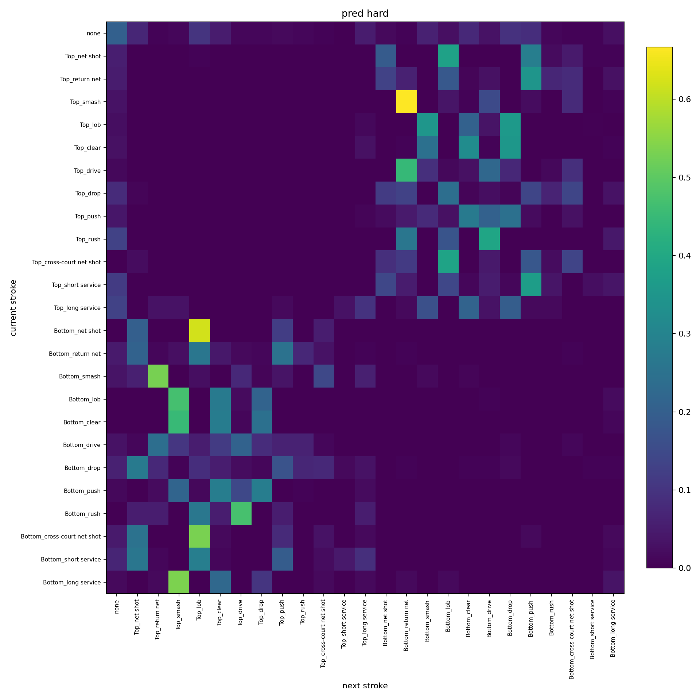
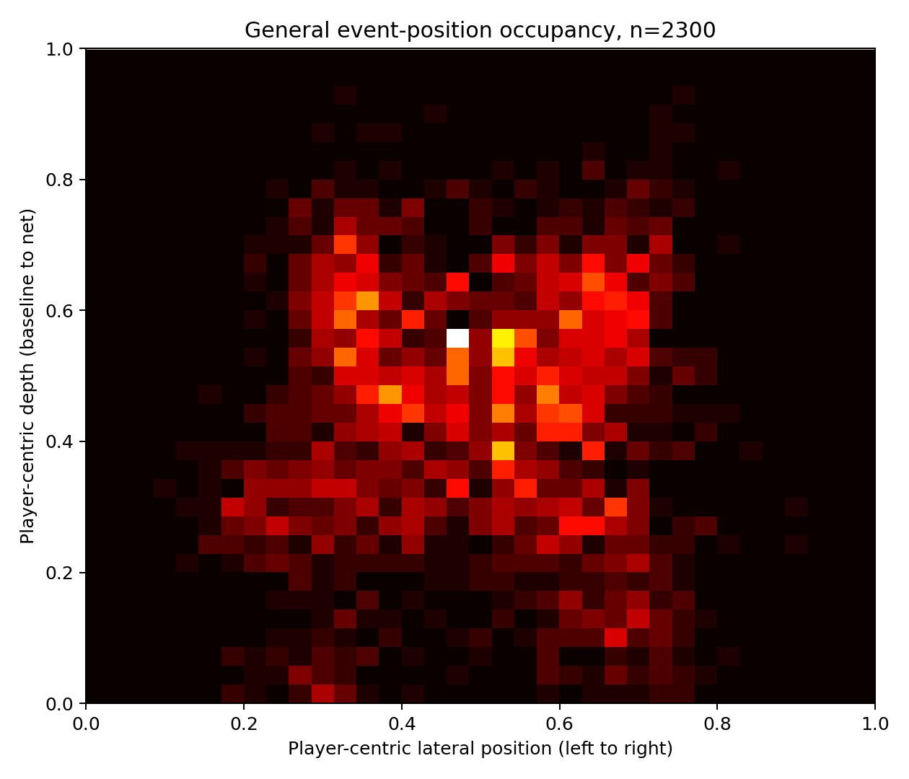
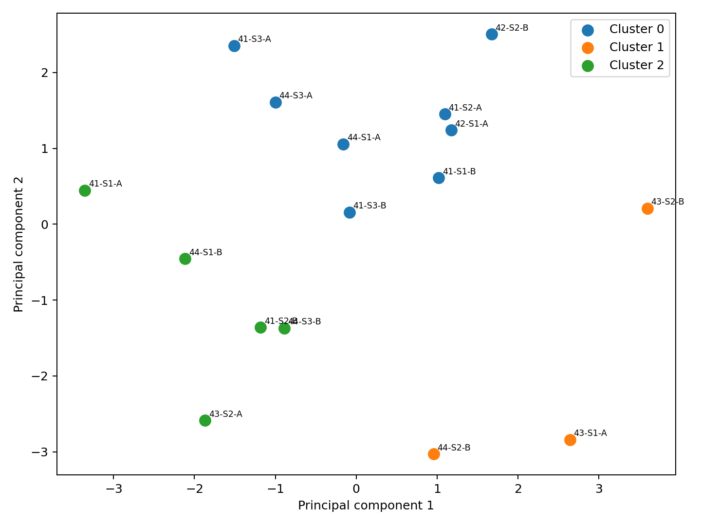

# Badminton Video Analytics: Current System, Results, and Insights

members: 
- Cao Pham Minh Dang - V202401280 - 24dang.cpm@vinuni.edu.vn 
- Pham Dinh Hieu - V202401287 - 24hieu.pd@vinuni.edu.vn 
- Pham Minh Hieu - V202200842 - 22hieu.pm@vinuni.edu.vn

## 1. Executive Summary

This project builds a badminton analytics system that converts broadcast video
into an ordered stream of predicted strokes and then mines that stream for
tactical patterns.

The current system combines:

- SA-CNN rally-view filtering;
- TrackNetV3 shuttle tracking and trajectory denoising;
- exact ShuttleSet hit labels for constructing and evaluating unseen-video
  stroke windows;
- ShuttleSet homography metadata for court normalization;
- YOLO26x-pose player detection and tracking;
- a fine-tuned Badminton-Stroke Transformer (`BST_CG_AP`);
- transition, pattern, spatial, and clustering analyses.

Videos `41-44` are designated as the unseen-video evaluation set. The tracked
Phase 09 to Phase 10 pipeline produces `3,192` structured stroke predictions
from these videos. After excluding `14` shared-feature alias rows, the clean
unseen-video evaluation contains `3,178` rows and achieves:

| Clean unseen-video metric | Result |
|---|---:|
| Side-aware top-1 accuracy | **69.04%** |
| Top-3 accuracy | **87.89%** |
| Player-side accuracy | **93.05%** |
| Stroke-type accuracy, ignoring side | **69.19%** |
| Supported-class macro-F1 | **66.64%** |

This is a substantial improvement over the earlier integrated baseline, whose
all-labeled accuracy was `8.41%`. The new pipeline also reduces the predicted
`none` rate from `56.43%` to `6.70%` and recovers recognizable attack-defense
sequences instead of collapsed `none` chains.

The most important remaining technical problem is **far-side player
extraction**. The far-side Top player has only about `54%` pose validity,
compared with about `99%` for the near-side Bottom player. On the stricter
`42-44` subset, accuracy is `76.71%` when Top-player pose validity is at least
`75%`, but only `56.05%` when it is below `50%`.

The current result is therefore a useful unseen-video ShuttleSet benchmark and
a deployable tactical-analysis baseline, but it is not yet a fully label-free
arbitrary-video system.

## 2. What the Current Results Prove

The Phase 10 structured table is produced by the perception and classification
pipeline. It contains predicted player side, predicted stroke type,
confidence, sequence order, and aligned feature paths.

The system supports deployable analyses that can be computed without a human
tactical annotator:

- predicted stroke distributions;
- Markov transition matrices;
- frequent stroke motifs;
- confidence-stratified analysis;
- player-event occupancy;
- approximate movement and strategy profiles.

Ground-truth annotations are used for training, benchmark construction,
evaluation, and comparison. They are not a separate project track. Tactical
claims derived from annotations remain clearly identified as ground-truth
findings, while claims derived from Phase 10 outputs are identified as
predicted findings.

The system does **not** currently predict:

- point winner;
- win or loss reason;
- exact shuttle landing location;
- persistent player identity in arbitrary unseen video;
- continuous footwork trajectories.

### 2.1 Important Benchmark Boundary

Videos `41-44` are the project's unseen-video evaluation set. The current
benchmark uses their raw broadcast frames for shuttle tracking, pose
extraction, feature generation, and stroke classification. It also uses
ShuttleSet metadata to construct and score the benchmark:

- Phase 02 exact `frame_num_int` labels define the active stroke windows;
- ShuttleSet `homography.csv` provides court calibration;
- ShuttleSet labels provide evaluation targets and persistent identity links.

Therefore, the current result should be described as an **unseen-video
raw-feature and classification benchmark with supplied temporal and court
metadata**. It should not be described as fully automatic inference on an
arbitrary unlabeled broadcast.

The inherited reference feature split historically labels video `41` as
validation and videos `42-44` as test. This report treats all videos `41-44` as
the project's unseen evaluation set and reports their clean aggregate as the
headline result. The clean `42-44` subset is retained as a stricter secondary
comparison for reproducibility.

For a truly new video, the system must instead use trajectory-based hit
detection, user-assisted court calibration, and a player re-identification
strategy.

## 3. System Overview

The project follows one raw-video analytics pipeline. ShuttleSet annotations
and pre-extracted features support training and evaluation, while videos
`41-44` are processed as the unseen-video evaluation set.

### 3.1 Raw-Video Analytics Pipeline

```text
Raw broadcast video
    -> SA-CNN rally-view filtering
    -> TrackNetV3 shuttle tracking and denoising
    -> hit-frame or exact-label stroke windows
    -> court homography
    -> player pose, tracking, and court position
    -> BST-compatible feature normalization
    -> BST stroke classification
    -> structured predicted stroke sequence
    -> tactical mining and movement analysis
```



*Figure 1. The single raw-video analytics pipeline. Training annotations and
features support model development; unseen videos `41-44` are processed
through perception, classification, and tactical mining. Exact hit labels and
known homographies currently support benchmark construction.*

### 3.2 Core Data Contract

Each classified stroke window is represented by:

```text
joints:     (T, 2, 17, 2)
positions:  (T, 2, 2)
shuttle:    (T, 2)
```

For BST inference, clips are padded or downsampled to sequence length `100`.
The final pose representation combines `17` COCO joints with `19` bone
vectors:

```text
JnB_bone:   (100, 2, 36, 2)
positions:  (100, 2, 2)
shuttle:    (100, 2)
video_len:  scalar
```

The final structured prediction row is approximately:

```text
(video_id, rally_id, event_rank, event_frame,
 predicted_player_side, predicted_stroke_type,
 confidence, top alternatives, feature quality)
```

## 4. Dataset and Evaluation Protocol

### 4.1 Local ShuttleSet Snapshot

| Data item | Count |
|---|---:|
| Raw broadcast videos | 44 |
| Set annotation files | 104 |
| Annotated strokes | 36,482 |
| Annotated rallies | 3,683 |
| Ground-truth stroke types | 19 |
| Prepared feature clips per variant | 33,481 |
| Pre-extracted feature variants | 6 |

There are `3,001` more annotation rows than prepared feature clips. The exact
upstream filtering rule responsible for this difference is unclear from the
current codebase.

### 4.2 Project Protocol

The report uses this project-level split:

| Role | Video identifiers |
|---|---|
| Training, development, and parameter selection | `1-39` |
| Unseen-video evaluation | `41-44` |

Video `40` is present in intermediate Phase 06 and Phase 07 outputs but is not
part of the final integrated unseen-video bundle.

For reproducibility, Phase 10 also preserves the inherited reference feature
split:

| Phase 10 evaluation group | Videos | Report role |
|---|---|---|
| Clean unseen-video aggregate | `41-44` | Headline project result |
| `reference_test_primary` | `42-44` | Stricter secondary subset |

The inherited reference split historically assigns video `41` to validation.
That historical identity is disclosed, but the project report designates and
analyzes all videos `41-44` as unseen videos.

## 5. Current Phase Status

Machine-readable summaries under `project/outputs/` are the source of truth
when older phase reports disagree with current outputs.

| Phase | Role | Current status | Main evidence or remaining gap |
|---|---|---|---|
| 00 | Environment and checkpoint inventory | Completed | Required repositories and checkpoints inventoried |
| 01 | Dataset inventory | Completed | 44 videos, 104 set CSVs, six feature variants validated |
| 02 | Ground-truth tactical table | Completed | 36,482 unique stroke rows; validation passed |
| 03 | BST feature collation | Completed | 33,481 clips collated into sequence-100 arrays |
| 04 | BST fine-tuning | Executed | Best validation macro-F1 `0.805` at epoch 6 |
| 05 | SA-CNN fine-tuning and rally filtering | Trained; boundary QA remains | Best validation F1 `0.903`; latest coverage smoke passed; human review pending |
| 06 | Shuttle tracking and denoising | Executed across protocol ranges | Inference outputs exist for `1-34`, `35-39`, and `40-44`; no proven all-44 TrackNet fine-tuning supervision |
| 07 | Stroke windows | Completed for unseen-video benchmark | Exact labeled windows support evaluation; trajectory detector remains required for fully unlabeled deployment |
| 08 | Court calibration | Supplied for unseen-video benchmark | Existing `homography.csv` used; new-video annotation workflow still requires implementation and QA |
| 09 | Pose and player-position features | Executed on `41-44`; quality review required | 3,192 bundles; far-side Top-player validity remains weak |
| 10 | Integrated BST inference | Completed | Clean unseen-video accuracy `69.04%` |
| 11 | Tactical mining | Completed | Transition, pattern, clustering, and spatial outputs generated |

## 6. Component Results

### 6.1 Phase 04: BST Stroke Classifier

The selected classifier is `BST_CG_AP`, initialized from the existing
ShuttleSet checkpoint and fine-tuned on the collated `JnB_bone` features.

| Training item | Value |
|---|---:|
| Training clips | 25,741 |
| Validation clips | 4,241 |
| Output classes | 25 side-aware merged classes |
| Sequence length | 100 |
| Best epoch | 6 |
| Best validation macro-F1 | **0.805** |
| Best-epoch validation accuracy | **82.74%** |

The 25 classes encode both camera-relative player side and stroke type:

```text
none + Top_<12 stroke types> + Bottom_<12 stroke types>
```

The classifier performs well on reference-quality features. The larger
difficulty is transferring that classifier to newly extracted raw-video
features without degrading pose, position, shuttle, and temporal alignment.

### 6.2 Phase 05: Rally Filtering

SA-CNN is fine-tuned as a binary court-view versus non-play classifier.

| Training item | Value |
|---|---:|
| Training images | 20,400 |
| Validation images | 3,000 |
| Best validation epoch | 20 |
| Best validation F1 | **0.903** |

The latest recorded coverage smoke reports:

| Rally-filtering metric | Result |
|---|---:|
| Annotated hit coverage | **97.32%** |
| Annotated rally overlap | **100%** |
| Machine validation | Passed |
| Human visual review | Pending |

These metrics show that the filter retains annotated play, but they do not
prove precise rally boundaries. Visual samples still show accepted intervals
that extend into post-rally close-ups. Boundary precision remains a deployment
issue because downstream shuttle and pose models will process those extra
frames.

### 6.3 Phase 06: Shuttle Tracking

TrackNetV3 runs on accepted Phase 05 intervals and produces raw and denoised
frame-level shuttle coordinates.

| Protocol range | Rally intervals | Frames | Raw coverage | Denoised coverage |
|---|---:|---:|---:|---:|
| Videos `1-34` | 3,078 | 1,193,188 | 85.72% | 90.44% |
| Videos `35-39` | 465 | 190,335 | 86.10% | 90.21% |
| Videos `40-44` | 472 | 196,792 | 86.63% | 90.99% |

For videos `40-44`, denoising:

- removes `19,384` implausible jump points;
- interpolates `27,953` short-gap points;
- produces zero visible out-of-range coordinates.



*Figure 2. Representative TrackNet trajectories. Shuttle paths are generally
coherent, while final close-up frames reveal remaining Phase 05 boundary
errors.*

TrackNet inference is operational across all protocol ranges. However, real
TrackNet fine-tuning remains blocked unless frame-level
`Frame,Visibility,X,Y` supervision can be proven or built for the full
development corpus.

### 6.4 Phase 07: Stroke Windows

For the unseen-video benchmark, exact Phase 02 hit labels provide the reference
stroke windows. They avoid the false-positive cost of trajectory-only hit
detection while preserving Phase 06 interval identifiers for downstream
feature extraction.

Current exact-label result on unseen videos `41-44`:

| Phase 07 item | Count |
|---|---:|
| Available Phase 02 labels | 3,316 |
| Exported exact events and windows | 3,192 |
| Exact matches | 3,192 |
| Labels outside Phase 06 intervals | 124 |

The `124` uncovered labels show that Phase 05 and Phase 06 interval coverage
still limits the unseen-video benchmark. For fully label-free deployment, the
trajectory-based detector remains necessary and must be evaluated separately.

### 6.5 Phase 08: Court Homography

The unseen ShuttleSet evaluation videos already have supplied per-video
homography metadata, so the active benchmark reads:

```text
project/dataset/ShuttleSet/set/homography.csv
```

For a new video, the intended workflow is one user-assisted court calibration
per stable tactical camera view, followed by overlay and reprojection QA.
Additional calibration is required only when a cut, zoom, or alignment drift
invalidates the current homography.

This unseen-video calibration workflow is specified but not yet demonstrated
as a completed project phase.

### 6.6 Phase 09: Pose and Player Position

YOLO26x-pose detects and tracks the two players, assigns stable Top/Bottom
ordering, and exports BST-compatible joints, player positions, shuttle
positions, and validity masks.

| Feature-quality metric | Result |
|---|---:|
| Exported feature bundles | 3,192 |
| Total processed frames | 183,007 |
| Player-side inconsistent frames | 0 |
| Both-player pose-missing rate | **0.85%** |
| Both-player position-missing rate | **0.36%** |
| Out-of-range accepted positions | 0 |

The low both-player missing rate can be misleading because player quality is
highly asymmetric:

| Player-side feature quality | Top, far side | Bottom, near side |
|---|---:|---:|
| Pose-valid rate | **54.29%** | **98.96%** |
| Position-valid rate | **54.40%** | **99.40%** |
| Pose-missing rate | 45.71% | 1.04% |
| Position-missing rate | 45.60% | 0.60% |

Most frames with a missing Top player still contain the Bottom player.
Therefore, `0.85%` both-player pose-missing does not mean both players are
usually extracted well.

## 7. Unseen-Video Integrated Classification Results

Phase 10 converts Phase 09 outputs to the fixed BST sequence-100 contract,
runs the selected Phase 04 checkpoint, and writes an ordered structured stroke
table.

### 7.1 Data Quality and Evaluation Rows

| Integration item | Count |
|---|---:|
| Total predictions | 3,192 |
| Clean rows after alias exclusion | 3,178 |
| Shared-feature alias rows excluded | 14 |
| Unseen videos | `41-44` |
| Clean secondary `42-44` subset rows | 2,027 |

The `14` excluded rows come from simultaneous annotations sharing a frame and
therefore sharing an overwritten feature source. They remain available as a
diagnostic group but do not enter the clean unseen-video result.

### 7.2 Unseen-Video Aggregate Result

| Metric on clean unseen videos `41-44` | Result |
|---|---:|
| Side-aware top-1 accuracy | **69.04%** |
| Top-3 accuracy | **87.89%** |
| Player-side accuracy | **93.05%** |
| Stroke-type accuracy, ignoring side | **69.19%** |
| Supported-class macro-precision | **67.34%** |
| Supported-class macro-recall | **72.04%** |
| Supported-class macro-F1 | **66.64%** |

The difference between `93.05%` side accuracy and `69.04%` full accuracy shows
that the system usually identifies which court side hit the stroke, while
fine-grained stroke-type discrimination remains harder.

The inherited clean `42-44` subset achieves `66.40%` side-aware top-1
accuracy, `86.43%` top-3 accuracy, and `64.07%` macro-F1. It is retained as a
secondary reproducibility result, not as the headline project metric.

### 7.3 Per-Video Variation

| Video | Rows | Side-aware accuracy | Top-3 accuracy | Player-side accuracy |
|---:|---:|---:|---:|---:|
| 41 | 1,151 | 73.68% | 90.44% | 94.79% |
| 42 | 619 | 63.97% | 85.14% | 89.50% |
| 43 | 550 | **53.27%** | 74.18% | 84.73% |
| 44 | 858 | **76.57%** | 95.22% | 98.60% |

Video `43` is the weakest domain, while video `44` is the strongest. This
variation is consistent with the observed far-side pose-quality differences
and shows why aggregate accuracy alone is insufficient.

### 7.4 Feature Quality Controls Accuracy on the Strict `42-44` Subset

| Secondary-subset quality group | Rows | Side-aware accuracy | Macro-F1 |
|---|---:|---:|---:|
| Top pose-valid rate `>=75%` | 760 | **76.71%** | **75.80%** |
| Top pose-valid rate `<50%` | 951 | **56.05%** | **52.32%** |
| Overall pose dropout `<25%` | 1,055 | **76.02%** | **71.48%** |



*Figure 3. Classification performance rises substantially when the far-side
Top player is detected reliably.*

This is the clearest systems-level diagnosis in the project: improving
far-side pose extraction is likely to produce a larger gain than changing the
mining algorithm or adding a more complex classifier head.

## 8. Tactical Mining Results

The clean predicted stream contains:

| Predicted mining item | Result |
|---|---:|
| Clean predicted strokes | 3,178 |
| Predicted rallies | 343 |
| Mean predicted rally length | 9.27 strokes |
| Predicted `none` rate | **6.70%** |
| High-confidence coverage at `confidence >= 0.8` | 35.59% |

Ground-truth findings describe ShuttleSet badminton tactics. Predicted
findings describe what the current video pipeline can recover.

### 8.1 Attack-Defense Transition Grammar

The ground-truth stream shows a recurring tactical structure:

```text
net shot -> lob -> smash -> defensive net
```

Ground-truth support:

| Ground-truth pattern | Rally support |
|---|---:|
| Net shot -> lob | 48.76% |
| Smash -> defensive net | 30.30% |
| Net shot -> lob -> smash | 18.11% |
| Net shot -> lob -> smash -> defensive net | 11.16% |

The predicted stream recovers the same structure in side-aware form:

| Predicted pattern | Rally support |
|---|---:|
| Top smash -> Bottom return net | 28.86% |
| Bottom lob -> Top smash | 18.08% |
| Bottom clear -> Top smash | 17.49% |
| Bottom smash -> Top return net | 15.45% |
| Top net shot -> Bottom lob -> Top smash | 7.58% |
| Top net shot -> Bottom lob -> Top smash -> Bottom return net | 4.66% |

These patterns support a clear interpretation: net pressure often forces a
lift, the lift creates an attacking opportunity, and the smash often produces
a defensive net reply rather than immediately ending the rally.

### 8.2 Transition Matrix Quality



*Figure 4. Row-normalized transition probabilities from hard predicted stroke
labels.*

| Transition estimator | Frobenius error | Mean row KL |
|---|---:|---:|
| Earlier integrated baseline | 3.652 | 11.723 |
| Current hard predictions | **1.232** | **0.511** |
| Current soft probabilities | 1.617 | 0.623 |
| High-confidence contiguous segments | **1.211** | 1.372 |

Compared with the earlier baseline, the current hard-prediction transition
matrix reduces:

- Frobenius error by **66.3%**;
- mean row KL by **95.6%**.

Hard predictions outperform probability-weighted soft transitions. The
classifier's residual probability mass blurs strong tactical transitions more
than it helps. High-confidence segments give slightly lower Frobenius error,
but retain only `35.59%` of strokes and fragment complete rallies.

### 8.3 Serve and Third-Shot Insight

Outcome-based opening analysis is available only from the ground-truth layer:

| Ground-truth opening | Server win rate |
|---|---:|
| Short service -> push -> clear | **37.50%** |
| Short service -> net shot -> lob | 49.13% |
| Short service -> lob -> smash | **53.52%** |
| Short service -> lob -> tap smash | **60.00%** |

The third shot matters more than the service label alone. Passive
push-to-clear continuations perform poorly, while continuations that create an
early attack perform better. This conclusion cannot yet be produced for a
fully label-free new video because the prediction path does not infer point
winners.

### 8.4 Player-Centric Spatial Occupancy

Top and Bottom are camera-relative positions, not persistent player
identities. Raw camera-side occupancy therefore confounds player strategy with
court side. The movement analysis rotates valid hitter locations into a
player-centric half-court:

- lateral coordinate: player's left `0` to right `1`;
- forward coordinate: baseline `0` to net `1`.

From `2,300` valid stroke-event positions:

| Occupancy result | Value |
|---|---:|
| Mean lateral position | 0.496 |
| Mean forward position | 0.450 |
| Events in central lateral corridor `[0.35, 0.65]` | 58.43% |
| Events in middle-depth band `[0.30, 0.70]` | 71.22% |
| Events in both central regions | 46.65% |



*Figure 5. Player-centric stroke-event occupancy. Camera-side differences are
removed before combining player positions.*

The concentration is consistent with central-base positioning at stroke
events. However, these are event samples, not continuous trajectories. They do
not directly measure recovery path, speed, or footwork efficiency.

### 8.5 Clustering: Useful Diagnostic, Weak Player Taxonomy

Two clustering views were evaluated:

| Clustering view | Units | Selected `k` | Silhouette | Bootstrap mean ARI | Interpretation |
|---|---:|---:|---:|---:|---|
| Ground-truth player-match profiles | 88 | 2 | 0.152 | 0.440 | Weak backcourt versus front/midcourt tendencies |
| Predicted video-side profiles | 8 | 2 | 0.200 | 0.505 | Mostly video/domain or perception-quality grouping |
| Extended player-set movement profiles | 16 | 3 | 0.151 | 0.365 | Exploratory movement summary only |

The low silhouette and moderate-to-low stability values do not support claims
of universal player archetypes.



*Figure 6. Considerable overlap between player-set movement profiles explains
the weak clustering result.*

The proposed hypothesis that frequent right-baselineward movement is
associated with smashing is not supported:

```text
correlation(right-baselineward displacement rate, predicted smash rate)
= -0.335
```

The largest positive reported association with smash rate is
netward-displacement rate (`r=0.304`), which is still too weak and
sample-dependent for a general tactical claim.

## 9. Clear Research Insights

### Insight 1: Perception Quality, Not Mining Complexity, Is the Main Bottleneck

The predicted tactical stream is already good enough to recover meaningful
transition structure. The largest remaining gain is upstream: improve the
far-side player representation before adding more sophisticated tactical
models.

Evidence:

- Top-player pose validity is about `54%`;
- Bottom-player pose validity is about `99%`;
- high Top-pose-valid rows reach `76.71%` accuracy;
- low Top-pose-valid rows fall to `56.05%`.

### Insight 2: Side Recognition Is Stronger Than Stroke Recognition

Player-side accuracy is `93.05%`, while full side-aware class accuracy is
`69.04%`. The system generally preserves who hit from which court side, but
still confuses fine stroke distinctions such as net shot, return net, drop,
push, rush, and long-service continuations.

The most efficient classifier improvement should target these confusion groups
rather than treating all classes equally.

### Insight 3: Sequence-Level Quality Improved More Than Top-1 Accuracy Alone Suggests

The new pipeline improves all-labeled accuracy from `8.41%` to `69.04%`, but
the more important downstream result is that it restores rally structure:

- predicted `none` rate falls from `56.43%` to `6.70%`;
- transition Frobenius error falls by `66.3%`;
- transition KL falls by `95.6%`;
- recognizable attack-defense motifs reappear.

This shows that evaluating only per-stroke accuracy would understate the
practical improvement for tactical mining.

### Insight 4: Coverage Metrics Must Be Paired With Boundary and Visual QA

Rally filtering and shuttle tracking have high coverage, but accepted
intervals can still include post-rally footage. A high retained-hit rate does
not imply precise temporal boundaries.

Deployment evaluation must report both:

- machine coverage and coordinate validity;
- visual review of interval starts, ends, camera cuts, and trajectory
  coherence.

### Insight 5: Tactical Claims Need the Correct Analytical Layer

Predicted sequences are useful for transitions, motifs, occupancy, and example
retrieval. They are not sufficient for causal statements about winning points
because the current deployment path does not predict outcomes.

Ground-truth and predicted tactical findings should always be reported
separately.

## 10. Limitations and Risks

### 10.1 Current Unseen-Video Benchmark Limitations

- The unseen-video integrated benchmark uses exact ShuttleSet hit labels and
  supplied homographies.
- Only four unseen videos contribute to the current predicted tactical stream.
- Fourteen simultaneous-event alias rows are excluded from clean metrics.
- Video `41` historically belongs to the inherited reference-validation split;
  this report discloses that history while designating `41-44` as the project
  unseen-video evaluation set.

### 10.2 Perception Limitations

- Far-side Top-player pose and position validity are weak.
- Rally boundaries sometimes include post-rally close-ups.
- TrackNet trajectories are denoised predictions, not verified shuttle labels.
- Approximate predicted shuttle endpoints are not physical landing points.

### 10.3 Tactical and Identity Limitations

- Top and Bottom are camera-relative sides.
- Persistent `A/B` identity in movement analysis comes from ShuttleSet
  evaluation metadata.
- Arbitrary-video deployment still requires player re-identification.
- Inter-stroke displacement is not continuous footwork.
- Clustering results are weak and should not be named as stable player styles.
- Outcome-based conclusions remain ground-truth-only.

## 11. Prioritized Next Work

### Priority 1: Improve Far-Side Player Extraction

Focus on video `43` and other low Top-pose-valid windows.

Recommended experiments:

- increase pose input resolution only for far-side candidates;
- crop the far court before pose inference;
- add court-aware candidate scoring and temporal recovery;
- compare YOLO26x-pose with a dedicated high-resolution pose model;
- evaluate accuracy changes by Top-pose-valid strata.

Success criterion: reduce the gap between Top and Bottom pose validity and
raise unseen-video integrated accuracy, especially on video `43`.

### Priority 2: Tighten Rally Boundaries

Improve Phase 05 interval starts and ends rather than only maximizing hit
coverage.

Recommended evaluation:

- boundary error relative to annotated first and last hits;
- false-positive tail duration;
- visual review across all unseen videos;
- impact of trimmed boundaries on TrackNet and pose quality.

### Priority 3: Complete the Fully Label-Free New-Video Path

The remaining required components are:

1. trajectory-based Phase 07 hit detection with selected parameters;
2. user-assisted Phase 08 court annotation and homography QA;
3. persistent player identity or re-identification;
4. end-to-end evaluation on videos outside the ShuttleSet metadata bundle.

### Priority 4: Improve Fine Stroke Distinctions

Target the classes that dominate transition errors:

- net shot versus return net;
- drop versus push;
- rush;
- long-service continuations.

Use per-class confusion analysis and feature-quality stratification before
changing the BST architecture.

### Priority 5: Expand Tactical Validation

Before making general player-style claims:

- evaluate more unseen matches;
- create more persistent player profiles;
- add continuous tracking if movement strategy is a core objective;
- report cluster stability and uncertainty for every claimed group.

## 12. Reproducibility and Main Artifacts

The main machine-readable sources behind this report are:

```text
project/outputs/tables/phase02_ground_truth_summary.json
project/outputs/bst_collated/merged_seq100_between_2_hits_with_max_limits/phase03_collation_summary.json
project/outputs/bst_training_all44/training_summary.json
project/outputs/sacnn_training_protocol/training_summary.json
project/outputs/rallies/phase05_rally_filtering_summary.json
project/outputs/shuttle/phase06_shuttle_tracking_summary.json
project/outputs/shuttle_train_1_34/phase06_shuttle_tracking_summary.json
project/outputs/shuttle_val_35_39/phase06_shuttle_tracking_summary.json
project/outputs/hit_frames/phase07_hit_frame_detection_summary.json
project/outputs/features_yolo26x_bst_tracked_phase02_41_44/phase09_feature_summary.json
project/outputs/integration/bst_tracked_phase09_41_44/phase10_summary.json
project/outputs/mining/bst_tracked_phase09_41_44/phase11_summary.json
project/outputs/movement_strategy/movement_strategy_summary.json
```

Important structured outputs:

```text
project/outputs/tables/shuttleset_ground_truth_strokes.csv
project/outputs/integration/bst_tracked_phase09_41_44/phase10_structured_strokes.csv
project/outputs/integration/bst_tracked_phase09_41_44/phase10_probabilities.npy
project/outputs/mining/bst_tracked_phase09_41_44/
project/outputs/movement_strategy/
```

## 13. Final Assessment

The project has progressed beyond a collection of disconnected perception
scripts. It now has one integrated pipeline from raw broadcast frames to
structured stroke predictions and tactical mining, evaluated on unseen videos
`41-44`.

The current pipeline is useful for:

- unseen-video ShuttleSet stroke classification;
- transition and frequent-pattern analysis;
- confidence-based example retrieval;
- player-centric stroke-event occupancy;
- diagnosing how perception quality affects tactical outputs.

It is not yet sufficient for:

- fully automatic arbitrary-video analysis;
- authoritative point-winning causal claims from predictions;
- exact shuttle landing analysis;
- stable player-style taxonomy;
- continuous footwork analysis.

The central engineering conclusion is direct: **the next major improvement
should come from better far-side player extraction and tighter rally
boundaries, not from adding a more complex mining algorithm.**
